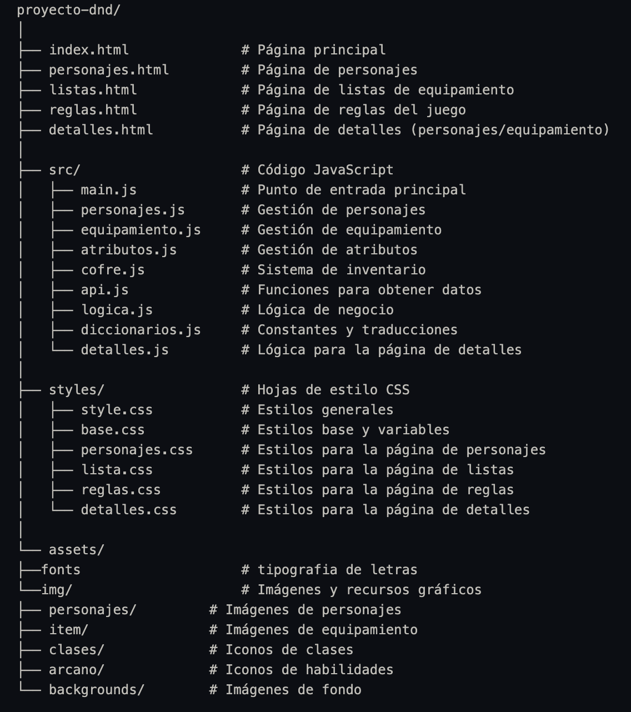

🐉 Proyecto D&D - Compendio Interactivo

## Descripción
Este proyecto es un compendio interactivo para Dungeons & Dragons, desarrollado como parte de un proyecto académico. La aplicación web permite a los usuarios explorar personajes, equipamiento, reglas del juego y gestionar su inventario personal a través de una interfaz intuitiva y temática.

## 📋 Contenido
* [Características](#✨-características)
* [Estructura del Proyecto](#📁-estructura-del-proyecto)
* [Tecnologías Utilizadas](#🛠️-tecnologías-utilizadas)
* [Instalación](#⬇️-instalación)
* [Uso](#🕹️-uso)
* [Autores](#✍️-autores)
* [Licencia](#📜-licencia)

## ✨ Características
* **Visualización de Personajes:** Explora diferentes personajes con sus atributos, habilidades y equipamiento.
* **Catálogo de Equipamiento:** Navega por armas, armaduras y objetos mágicos.
* **Reglas del Juego:** Consulta las reglas básicas y avanzadas de D&D.
* **Sistema de Inventario:** Gestiona tu propio cofre de equipamiento.
* **Diseño Responsivo:** Experiencia optimizada para dispositivos móviles y de escritorio.
* **Interfaz Temática:** Diseño visual inspirado en el mundo medieval y de fantasía.

## 📁 Estructura del Proyecto

⚙️ 

## 🛠️ Tecnologías Utilizadas
* HTML5: Estructura de las páginas
* CSS3: Estilos y diseño responsivo
* JavaScript (ES6+): Lógica de la aplicación
* Módulos ES6: Organización modular del código
* LocalStorage: Almacenamiento local para el inventario
* Fetch API: Obtención de datos

## ⬇️ Instalación
Clona este repositorio: https://github.com/CarlosDanielArauzSanjuan/Proyecto_JavaScript_ArauzCarlosSanjuanDaniel

## 🕹️ Uso
navega a travez de https://proyecto-java-script-arauz-carlos-sanjuan-daniel.vercel.app/

## ✍️ Autores
https://github.com/CarlosDanielArauzSanjuan

## 📜 Licencia
Licencia entregada por CampusLands